# spark-lut-patch

|      |
| :--: |
||
|  |

## Downloads

[Download the demo project](https://github.com/positlabs/spark-lut-patch/archive/master.zip)

View patch file [ColorLUT.arp](https://raw.githubusercontent.com/positlabs/spark-lut-patch/master/patches/ColorLUT.arp) (you can save this and import it into your project)

[Download the PSD](./luts.psd) edit this file to create your own custom LUTs.

## NOTE

Texture compression settings matter. If the output looks bad, try overriding the texture compression settings for the LUTs.

## Included LUTs

All of Photoshop's built-in 3dl files, converted to pngs.

|               |               |               |
| ------------- | ------------- | ------------- |
| neutral  | futuristic_bleak  | candlelight |
|   | 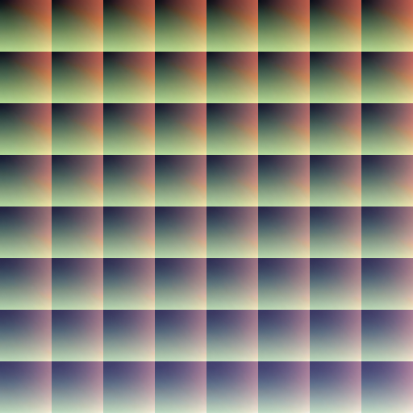 | 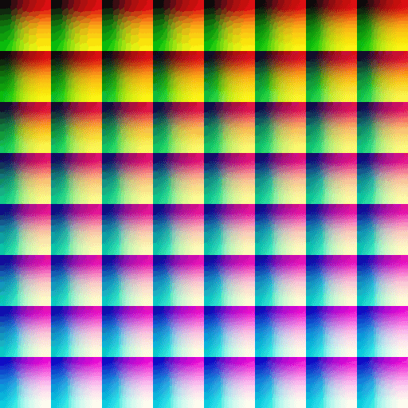 |
| horror_blue | drop_blues | kodak_5218_kodak_2383 |
| 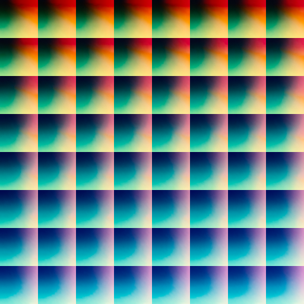 | 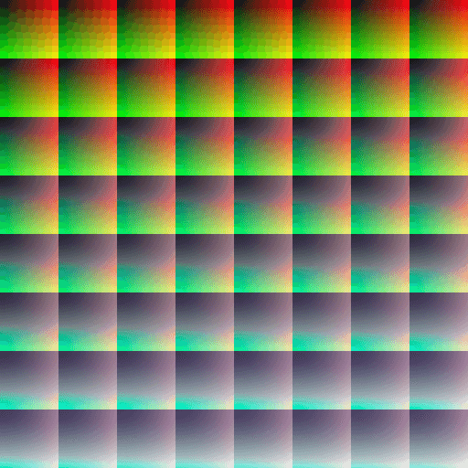 | 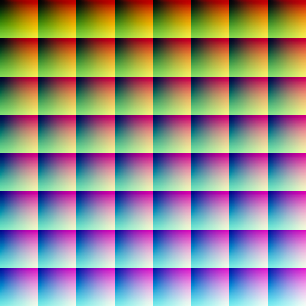
| edgy_amber | kodak_5218_kodak_2395 | filmstock_50 |
| 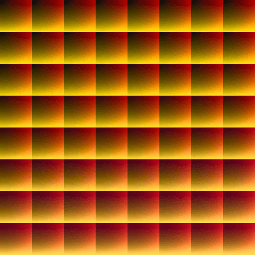 | 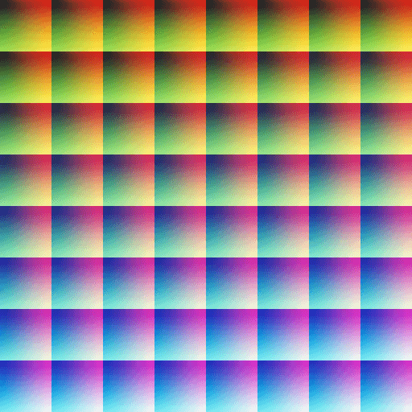 | 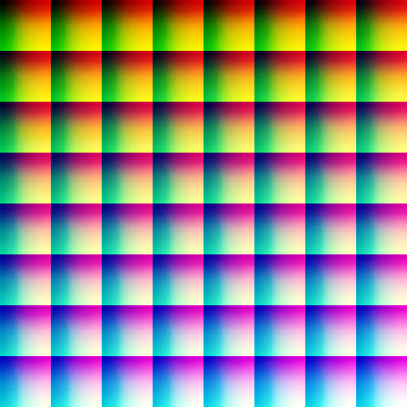 |
| kodak_5295_fuji_3510 | foggy_night | late_sunset |
|  | 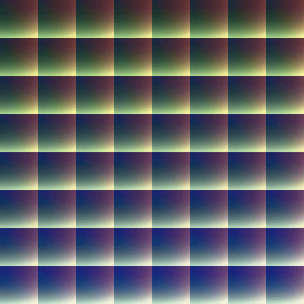 | 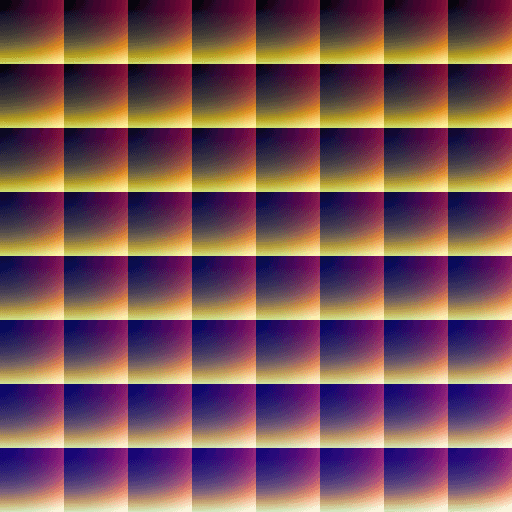 |
| fuji_eterna_250d_fuji_3510 | moonlight | fuji_eterna_250d_kodak_2395 |
| 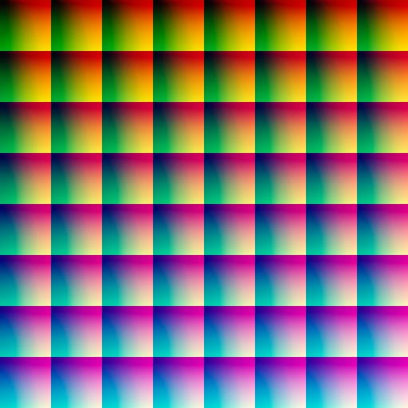 | 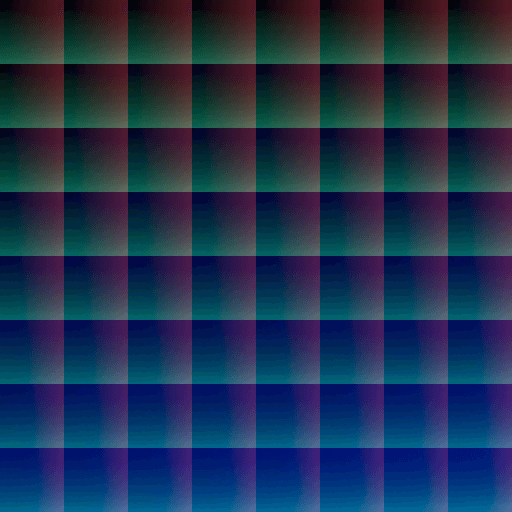 | 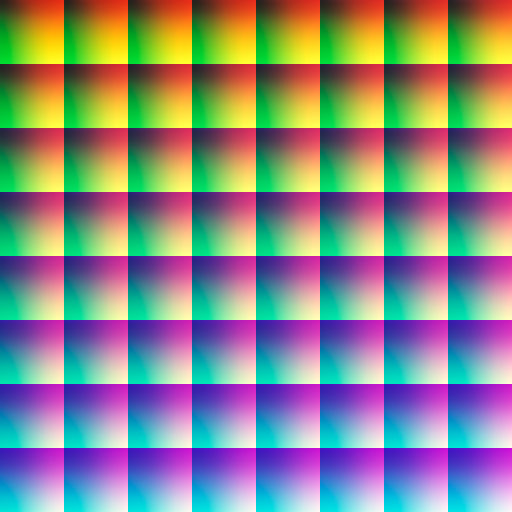 |
| night_from_day | fuji_f125_kodak_2393 | teal_orange_plus_contrast |
| 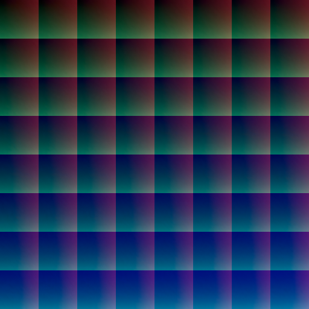 | 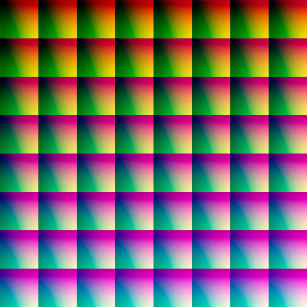 | 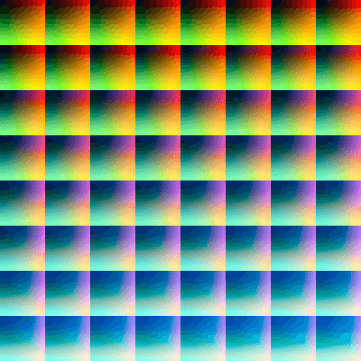 |
| fuji_f125_kodak_2395 | tension_green | fuji_reala_500d_kodak_2393 |
|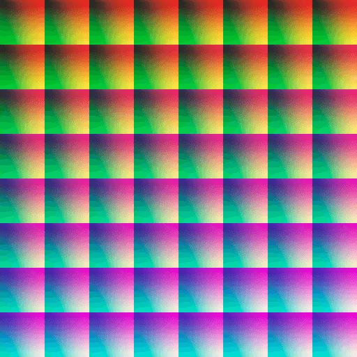 | 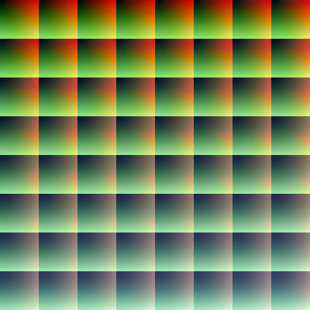 |  |

## Effects Gallery

If you use the patch in your effect, I'll feature it here. Just send a tryit link, icon, title, and description!
